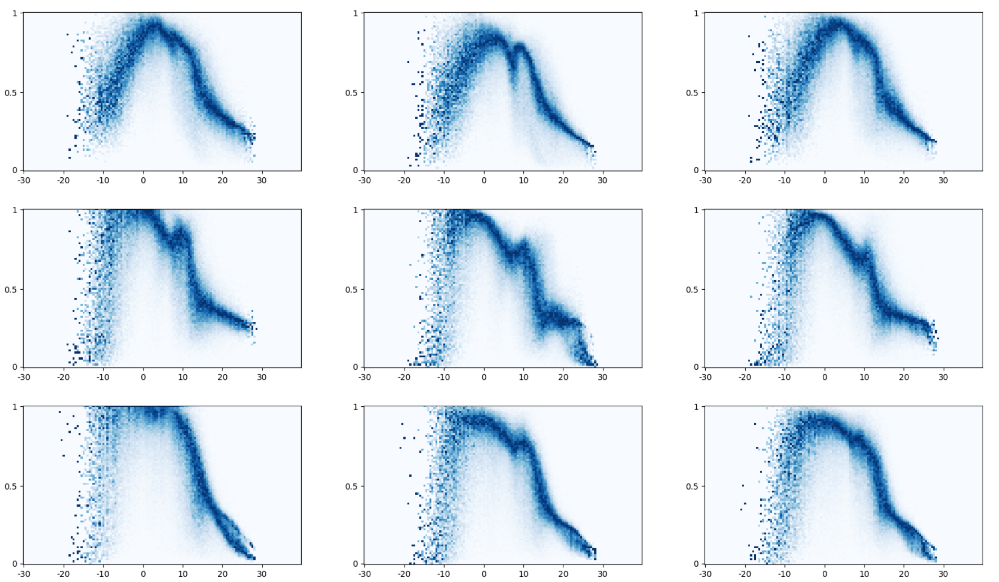

# Hybrid Machine Learning Model for Predicting Cherry Tree Phenology

This repository contains the code used for combining biophysical process-based model of cherry tree phenology with machine learning methods for inter-comparing their dynamics.

The code can be used to reproduce the results of the manuscript titled "Hybrid Phenology Modeling for Predicting Temperature Effects on Tree Dormancy".

[//]: # (![Schematic overview of the model structure]&#40;figures/schematic_overview.png&#41;)

 

The image above shows plots of different temperature response curves learned in Japan under different random seeds controlling weight initialization and data split. $3\times 3$ plots are shown that were generated using seeds 1,2,3 respectively (from left to right) for weight initialization and 1,2,3 respectively (from top to bottom) for the data split.

## Prerequisites

- Python 3.11
- Used packages and versions are specified in `requirements.txt`.
- Optional: CUDA (version 11.6 was used)

## Data

A cherry Tree Phenology data was compiled from various sources by George Mason’s Department of Statistics and can be found in [this](https://github.com/GMU-CherryBlossomCompetition/peak-bloom-prediction) GitHub repository. 
The repository data is updated every year. To ensure reproducibility of the work we included a snapshot of the dataset that we used in this repository. Data sources are listed in the corresponding `data/original/README.md`. 

Publicly available MERRA-2 temperature data was used in this research. The code used for collecting the data can be found [here](https://github.com/ronvree/MERRA-2-Download). The resulting file should be stored in the `data/merra_v2` folder.
Alternatively, the file containing all temperature data can be obtained [here](https://zenodo.org/records/14045891). The file should be extracted and stored in `data/merra_v2/daily_temperatures.csv`.

## Usage

Running `main.sh` reproduces all results presented in the manuscript. Note that fitting all models for all seeds can take a long time (in the order of weeks).

The `runs` folder contains all configurable Python scripts used to run experiments.

The `scripts` folder contains all configured scripts that generated the results presented in the manuscript. The `seeds.txt` file lists all seeds used to generate the results.

### Reproducing Paper Results
The `main.sh` script can be decomposed in the following sections. All results/plots are generated in the `results_figures` folder.

Train and evaluate models in setting 1 (As described in the paper):

| Model       | Script           |
|-------------|------------------|
| Chill Hours | `train_pb_hour.sh` |
| Utah Chill  | `train_pb_utah.sh` |
| Chill Days  | `train_pb_days.sh` |
| Hybrid      | `train_df_mlp.sh`  |
| LSTM        |     `train_lstm_baseline.sh`             |

Train and evaluate models in setting 2 & 3 (As described in the paper):

| Model       | Script                                                                                   |
|-------------|------------------------------------------------------------------------------------------|
| Chill Hours | `train_pb_hour_species.sh`                                                               |
| Utah Chill  | `train_pb_utah_species.sh`                                                               |
| Chill Days  | `train_pb_days_species.sh`                                                               |
| Hybrid      | `train_df_mlp_species.sh` (setting 2)  `train_df_mlp_species_holdout.sh` (setting 3) |
| LSTM        | `train_lstm_baseline_species.sh`                                                         |

Ablation study using the Utah model in the differentiable model approximation:

`train_df_utah.sh`

Visualizations of the learned temperature response curves:

`plot_learned_temperature_function.sh`

### Examples

To fit a biophysical model (with location-specific parameters) using grid search run:

`python3 -m runs.fit_eval --model_cls LocalUtahChillModel --include_temperature --model_name LocalUtahChillModel_seed_123 --seed 123 --locations selection`

To fit the hybrid model in Japan run the following:

`python3 -m runs.fit_eval --model_cls NNChillModel --include_temperature --model_name NNChillModel_japan_seed_123 --seed 123 --num_epochs 20000 --optimizer adam --lr 1e-3 --weight_decay 1e-4 --scheduler_step_size 2000 --scheduler_decay 0.9 --loss_f nll --locations japan_yedoensis_sargentii`

