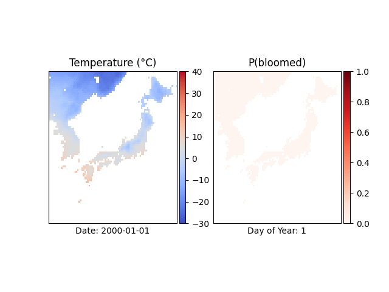

# Hybrid Machine Learning Model for Predicting Cherry Tree Phenology

This repository contains the code used for combining biophysical process-based model of cherry tree phenology with machine learning methods for improved phenology predictions.

The code can be used to reproduce the results of the manuscript titled "Hybrid Phenology Modeling for Predicting Temperature Effects on Tree Dormancy".

[//]: # (![Schematic overview of the model structure]&#40;figures/schematic_overview.png&#41;)

 

## Prerequisites

- Python 3.11
- Used packages and versions are specified in `requirements.txt`.
- Optional: CUDA (version 11.6 was used)

## Data

A cherry Tree Phenology data was compiled from various sources by George Mason’s Department of Statistics and can be found in [this](https://github.com/GMU-CherryBlossomCompetition/peak-bloom-prediction) GitHub repository. The repo should be cloned and data should be stored in `data/original`

Publicly available MERRA-2 temperature data was used in this research. The code used for collecting the data can be found [here](https://github.com/ronvree/MERRA-2-Download). The resulting file should be stored in the `data/original` folder.

## Usage

The `runs` folder contains all configurable Python scripts used to run experiments.

The `scripts` folder contains all configured scripts that generated the results presented in the manuscript. The `seeds.txt` file lists all seeds used to generate the results.

Running `main.sh` reproduces all results presented in the manuscript. Note that fitting all models for all seeds can take a long time (in the order of weeks).

### Examples

To fit a biophysical model (with location-specific parameters) using grid search run:

`python3 -m runs.fit_eval --model_cls LocalUtahChillModel --include_temperature --model_name LocalUtahChillModel_seed_123 --seed 123 --locations selection`

To fit the hybrid model in Japan run the following:

`python3 -m runs.fit_eval --model_cls NNChillModel --include_temperature --model_name NNChillModel_japan_seed_123 --seed 123 --num_epochs 20000 --optimizer adam --lr 1e-3 --weight_decay 1e-4 --scheduler_step_size 2000 --scheduler_decay 0.9 --loss_f nll --locations japan_yedoensis_sargentii`
